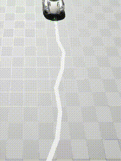

# Sim to Real in AMD Schola

<div style="display: flex; gap: 20px; align-items: center;">
  <div>
    
    <p align="center"></p>
  </div>
  <div>
    
    <p align="center"></p>
  </div>
</div>

In this guide, we will demonstrate how to replicate a physical device in Unreal Engine and train it using reinforcement learning with AMD Schola.

## What is Sim to Real?

Sim-to-Real is the process of developing and training agents in a simulated (virtual) environment and then transferring them to operate on physical hardware in the real world. This approach is widely used in robotics and reinforcement learning because it enables rapid prototyping and testing without incurring the risks and costs associated with using physical hardware during early development stages.

## Agent Car

The physical device we use is the [PiCar](https://docs.sunfounder.com/projects/picar-x/en/latest/).
Please see the device specification directly to get familiar with it. In particular, this PiCar has a max speed of 50 cm/s (1.8 km/h) and turning radius of 29 cm.
We will replicate PiCar using the [Chaos Vehicles](https://dev.epicgames.com/documentation/en-us/unreal-engine/vehicles-in-unreal-engine) module in Unreal Engine,
and use the color sensor to collect observation as explained later.

## Training Task: Line Following


The goal is to use reinforcement learning to train the agent to follow a line on the floor. The agent will receive observations from a simulated color sensor that detects the line on the floor and will learn to steer left or right to stay on the line.

## Environment Design

The simulated environment consists of a simple track with a black line on a white floor, and the agent is set to always move forward at a constant speed. The agent is trained with the following:

- **Observation (Simulating Color Sensors):** Three binary values (0/1) indicating whether the three color sensors detect the floor or the line.
- **Actuator:** Left and right steering with a float range from -1.0 to +1.0.
- **Reward Function:** +1 reward for every unit moved forward along the line.
- **Status Function:** The episode ends when the agent deviates more than 10 cm from the line.


## Training

Training is conducted with Schola in Unreal Engine using the [Stable Baselines3 (SB3)](https://stable-baselines3.readthedocs.io/en/master/) library with the [Proximal Policy Optimization (PPO)](https://stable-baselines3.readthedocs.io/en/master/modules/ppo.html) algorithm.
In our experiment, the agent achieved good performance after 2 million steps of training.


> **Note** \
> Use the `--save-final-policy` and `--export-onnx` flags during training to save the final policy and export it to ONNX format.

## Using the ONNX Model

Copy the `.onnx` file to the PiCar and use the [ONNX Runtime for Raspberry Pi](https://onnxruntime.ai/docs/tutorials/iot-edge/rasp-pi-cv.html) to run the model.
The PiCar will use the trained model to make decisions based on the observations from the color sensor.
The output of the model will be the steering actions, which will be sent to the PiCar's steering motor.
Below is an example of using the ONNX model with the PiCar.

```python
import numpy as np
import onnxruntime
from picarx import Picarx
import time

def generate_input_from_sensors(sensor_values):
    """
    Convert grayscale sensor values to ONNX model input format.
    Sensor values less than 700 are converted to 0, and values greater than or equal to 700 are converted to 1.
    """
    A = 0 if sensor_values[0] > 700 else 1
    B = 0 if sensor_values[1] > 700 else 1
    C = 0 if sensor_values[2] > 700 else 1
    return np.array([[A, A, A, B, B, B, C, C, C]], dtype=np.float32)

def run_inference(session, input_data):
    """
    Run inference on the ONNX model using the provided input data.
    """
    input_feed = {}
    for input_tensor, data in zip(session.get_inputs(), input_data):
        input_feed[input_tensor.name] = data

    output_name = session.get_outputs()[0].name
    output = session.run([output_name], input_feed)[0]
    return output

def map_output_to_steering(output):
    """
    Map the ONNX model output to steering angle.
    Output range is assumed to be [-1, 1], where -1 is full left and 1 is full right.
    """
    print(f"Output: {output}")
    return output[0][0] * 90  # Scale to servo angle range (-90 to 90)

if __name__ == "__main__":
    # Initialize Picarx and ONNX model
    px = Picarx()
    model_path = "ppo_final.onnx"
    session = onnxruntime.InferenceSession(model_path)

    try:
        while True:
            # Start moving forward
            px.forward(1)

            # Get grayscale sensor values
            sensor_values = px.get_grayscale_data()
            
            # Generate ONNX model input
            input_data = [generate_input_from_sensors(sensor_values), np.array([[[0]]], dtype=np.float32)]  # State-in is unused

            # Run inference
            output = run_inference(session, input_data)

            # Map output to steering angle
            steering_angle = map_output_to_steering(output)
            
            # Set steering angle
            px.set_dir_servo_angle(steering_angle)
    finally:
        # Stop the robot
        px.forward(0)
```

## Acknowledgements

We gratefully acknowledge the contributions from Abhi Sachdeva, Josue Solano, Peter Quawas, Pramesh Singhavi, and Ryan Luo of UC San Diego's [ECE 191 course](https://ece191.weebly.com/), taught by [Professor Xinyu Zhang](https://xyzhang.ucsd.edu/); the proof-of-concept resulting from their Senior Design Project catalyzed this demo.

